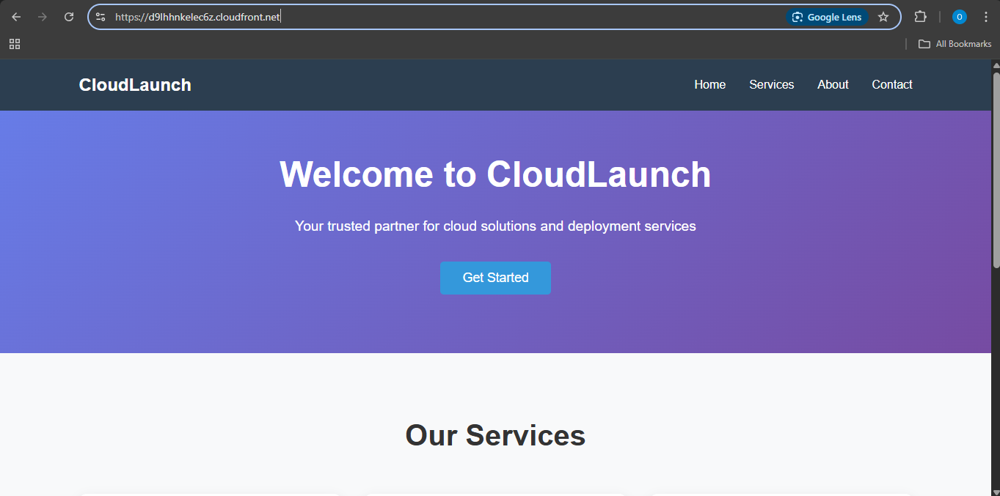
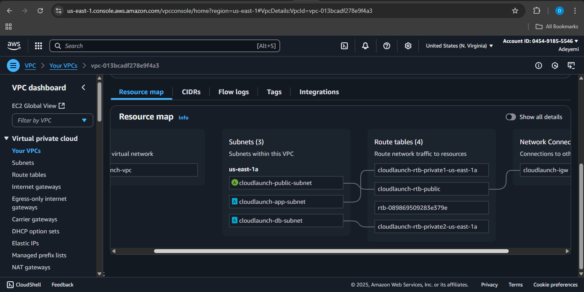
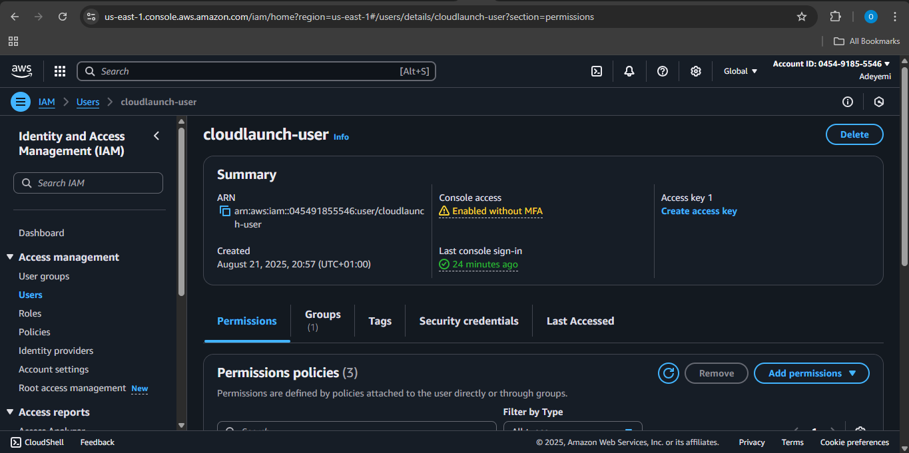

 # CloudLaunch - AWS Cloud Deployment Project

## Project Overview

CloudLaunch is a lightweight cloud platform that demonstrates modern AWS deployment practices. This project showcases a static company website with secure document storage, implemented using AWS core services including S3, IAM, and VPC following security best practices and the principle of least privilege.

## Architecture

The project implements a multi-tier architecture with:
- **Public Layer**: Static website hosted on S3 with CloudFront CDN
- **Access Control Layer**: IAM users with granular permissions
- **Network Layer**: VPC with segmented subnets for different tiers
- **Security Layer**: Security groups with least privilege access

---

## Task 1: Static Website Hosting with S3 + IAM

### S3 Buckets Created

#### 1. `cloudlaunch-site-bucket-public` (Public Website)


- **Purpose**: Hosts the static CloudLaunch company website
- **Access**: Publicly readable (anonymous users)
- **Features**: 
  - Static website hosting enabled
  - Custom HTML/CSS responsive design
  - Error page handling (404.html)
- **Website URL**: `https://d9lhhnkelec6z.cloudfront.net/`

#### 2. `cloudlaunch-private-bucket-1` (Private Documents)
- **Purpose**: Internal document storage
- **Access**: Restricted to designated IAM user only
- **Permissions**: GetObject and PutObject only (no delete operations)

#### 3. `cloudlaunch-visible-only-bucket-private` (Restricted Access)
- **Purpose**: Demonstrates granular access control
- **Access**: IAM user can list bucket but cannot access contents
- **Security**: Implements read-only visibility without content access

### CloudFront Distribution (Bonus Implementation)

- **Distribution Domain**: `https://d9lhhnkelec6z.cloudfront.net/`
- **Features**:
  - HTTPS enforcement (HTTP redirects to HTTPS)
  - Global edge locations for improved performance
  - Custom error pages
  - Caching optimization for static content
- **Origin**: S3 website endpoint (not bucket endpoint)
- **Security**: Automatic HTTP to HTTPS redirection

### IAM User Implementation

#### User: `cloudlaunch-user`
- **Access Type**: Programmatic + Console access
- **Password Policy**: Must change on first login
- **Permissions**: Custom policy with precise access controls

#### Custom IAM Policy: `CloudLaunchUserPolicy`

```json
{
    "Version": "2012-10-17",
    "Statement": [
        {
            "Sid": "ListAllBuckets",
            "Effect": "Allow",
            "Action": "s3:ListAllMyBuckets",
            "Resource": "*"
        },
        {
            "Sid": "ListSpecificBuckets",
            "Effect": "Allow",
            "Action": "s3:ListBucket",
            "Resource": [
                "arn:aws:s3:::cloudlaunch-site-bucket-public",
                "arn:aws:s3:::cloudlaunch-private-bucket-1",
                "arn:aws:s3:::cloudlaunch-visible-only-bucket-private"
            ]
        },
        {
            "Sid": "GetObjectSiteBucket",
            "Effect": "Allow",
            "Action": "s3:GetObject",
            "Resource": "arn:aws:s3:::cloudlaunch-site-bucket-public/*"
        },
        {
            "Sid": "GetPutObjectPrivateBucket",
            "Effect": "Allow",
            "Action": [
                "s3:GetObject",
                "s3:PutObject"
            ],
            "Resource": "arn:aws:s3:::cloudlaunch-private-bucket-1/*"
        },
        {
            "Sid": "VPCReadOnlyAccess",
            "Effect": "Allow",
            "Action": [
                "ec2:DescribeVpcs",
                "ec2:DescribeSubnets",
                "ec2:DescribeRouteTables",
                "ec2:DescribeInternetGateways",
                "ec2:DescribeSecurityGroups"
            ],
            "Resource": "*"
        }
    ]
}
```

**Policy Features**:
- ✅ List access to all three buckets
- ✅ Read-only access to site bucket
- ✅ Read/Write access to private bucket (no delete)
- ✅ List-only access to visible-only bucket
- ✅ VPC read-only permissions for infrastructure viewing
- ❌ No delete permissions anywhere
- ❌ No access to other AWS services

---

## Task 2: VPC Network Design

### VPC Architecture

#### Core VPC: `cloudlaunch-vpc`
- **CIDR Block**: `10.0.0.0/16`
- **DNS Hostnames**: Enabled
- **DNS Resolution**: Enabled

### Network Segmentation

#### Public Subnet: `cloudlaunch-public-subnet`
- **CIDR**: `10.0.1.0/24`
- **Purpose**: Load balancers and public-facing services
- **Internet Access**: Yes (via Internet Gateway)
- **Route Table**: `cloudlaunch-public-rt`

#### Application Subnet: `cloudlaunch-app-subnet`
- **CIDR**: `10.0.2.0/24`
- **Purpose**: Application servers and business logic
- **Internet Access**: No (private subnet)
- **Route Table**: `cloudlaunch-app-rt`

#### Database Subnet: `cloudlaunch-db-subnet`
- **CIDR**: `10.0.3.0/28` (16 IP addresses)
- **Purpose**: Database services (RDS-ready)
- **Internet Access**: No (private subnet)
- **Route Table**: `cloudlaunch-db-rt`

### Internet Gateway
- **Name**: `cloudlaunch-igw`
- **Attachment**: `cloudlaunch-vpc`
- **Purpose**: Provides internet access to public subnet

### Security Groups

#### Application Security Group: `cloudlaunch-app-sg`
- **Purpose**: HTTP access within VPC
- **Inbound Rules**:
  - HTTP (Port 80) from VPC CIDR (10.0.0.0/16)
- **Outbound Rules**: All traffic (default)

#### Database Security Group: `cloudlaunch-db-sg`
- **Purpose**: Database access from application tier only
- **Inbound Rules**:
  - MySQL/Aurora (Port 3306) from App Subnet (10.0.2.0/24)
- **Outbound Rules**: All traffic (default)

### Route Tables Configuration

| Route Table | Associated Subnet | Routes |
|-------------|------------------|---------|
| `cloudlaunch-public-rt` | Public Subnet | `0.0.0.0/0` → Internet Gateway |
| `cloudlaunch-app-rt` | App Subnet | Local VPC traffic only |
| `cloudlaunch-db-rt` | DB Subnet | Local VPC traffic only |

---

## Access Information

### AWS Console Access
- **Console URL**: `arn:aws:iam::045491855546:user/cloudlaunch-user`
- **Account ID**: `[cloudlaunch-user]`
 

### IAM User Credentials
- **Username**: `cloudlaunch-user`
- **Password**: `[auto-generated-password]`
- **Password Reset**: Required on first login
- **Access Keys**: Available for programmatic access

### Website URLs
- **S3 Static Website**: `http://cloudlaunch-site-bucket-public.s3-website-us-east-1.amazonaws.com`
- **CloudFront Distribution**: `https://d9lhhnkelec6z.cloudfront.net/`

---

## Implementation Details

### Security Best Practices Implemented

1. **Principle of Least Privilege**
   - IAM user has minimal required permissions only
   - No unnecessary access to AWS services
   - Specific resource-level permissions

2. **Network Segmentation**
   - Three-tier architecture (public, app, database)
   - Private subnets have no internet access
   - Security groups restrict traffic by layer

3. **Access Controls**
   - Bucket-level and object-level permissions
   - Public access limited to website content only
   - Private documents secured from public access

4. **HTTPS Enforcement**
   - CloudFront automatically redirects HTTP to HTTPS
   - SSL/TLS encryption for all web traffic

### Technical Specifications

- **AWS Region**: `us-east-1`
- **Availability Zones**: Single AZ (cost optimization)
- **Cost**: $0.00 (Free Tier compliant)
- **Services Used**: S3, CloudFront, IAM, VPC, EC2 (Security Groups)

---

## Project Structure

```
cloudlaunch-assessment/
├── README.md                          # This file
├── website/
│   ├── index.html                     # Main website page
│   ├── styles.css                     # CSS styling
│   └── error.html                     # 404 error page
├── screenshots
    ├── cloudfront.png
    ├── user-created.png
    ├── vpc-architecture.png 
```

---

## Testing and Verification

### Functionality Tests Completed

✅ **Website Accessibility**
- S3 static website loads correctly
- CloudFront distribution serves content
- HTTP redirects to HTTPS
- Error pages display properly

✅ **IAM Permissions**
- User can list all three buckets
- User can read from site bucket
- User can read/write to private bucket
- User cannot access visible-only bucket contents
- User cannot delete from any bucket

✅ **Network Configuration**
- VPC and subnets created correctly
- Route tables configured properly
- Security groups allow appropriate traffic
- Private subnets have no internet access

✅ **Security Controls**
- Public bucket accessible to anonymous users
- Private buckets blocked from public access
- IAM policy enforces least privilege
- CloudFront enforces HTTPS

---

## Cost Optimization

This project uses only AWS Free Tier services:
- **S3**: 5GB storage, 20,000 GET requests, 2,000 PUT requests
- **CloudFront**: 50GB data transfer, 2,000,000 requests
- **IAM**: No charges
- **VPC**: No charges for basic components

**No paid resources used**: EC2 instances, NAT Gateways, RDS, etc.

---

## Future Enhancements

Potential improvements for production deployment:
- Multi-AZ deployment for high availability
- NAT Gateway for private subnet internet access
- AWS Certificate Manager for custom domain SSL
- CloudWatch monitoring and logging
- Auto Scaling Groups for application tier
- RDS Multi-AZ database deployment
- AWS WAF for web application firewall

---

## Conclusion

The CloudLaunch project successfully demonstrates:
- Secure static website hosting using S3 and CloudFront
- Granular access control using IAM policies
- Network segmentation using VPC and security groups
- Implementation of AWS security best practices
- Cost-effective deployment within Free Tier limits

This architecture provides a solid foundation for scalable cloud applications while maintaining security and cost efficiency.

---

**Project Author**: Olukokun Adeyemi Favour
**Completion Date**: 22nd August, 2025 
**AWS Assessment**: AltSchool Cloud Engineering - Semester 3, Month 1.